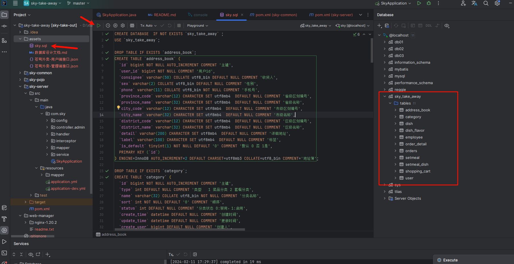
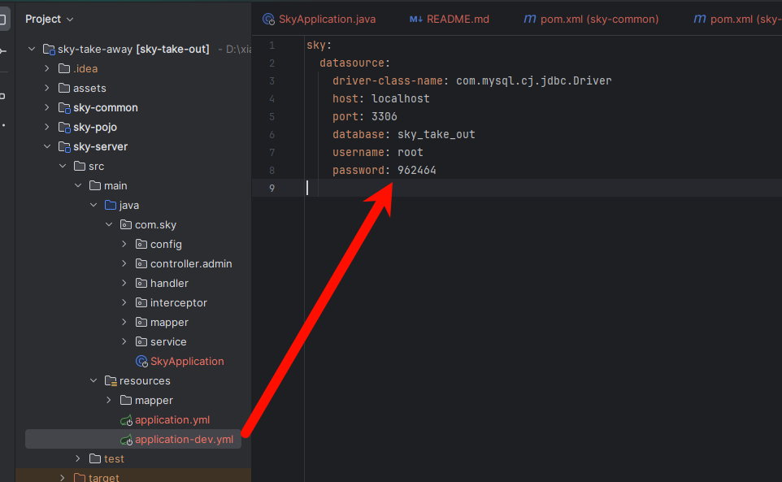
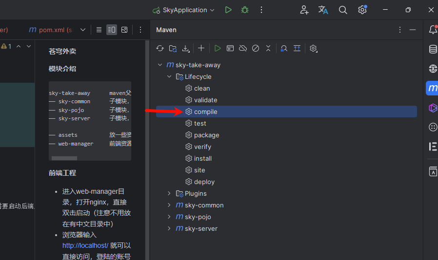
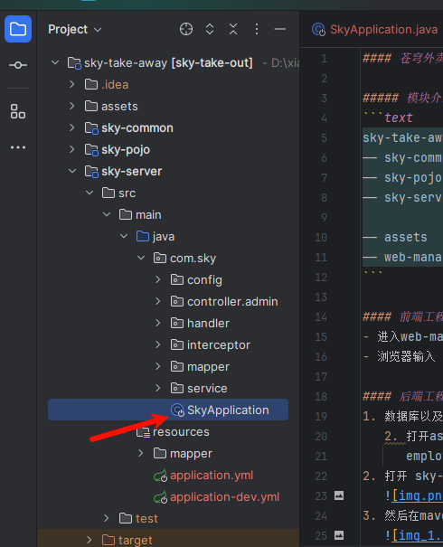

#### 苍穹外卖

##### 模块介绍
```text
sky-take-away      maven父工程，统一管理依赖版本，聚合其他字模块
—— sky-common      子模块，存放公共类，例如：工具，常量...
—— sky-pojo        子模块，存放实体类，VO、DTO等
—— sky-server      子模块，后端服务，存放配置文件、Controller、Service、Mapper等

—— assets          放一些资源，主要是为了方在一块，例如：sql文件，接口文件等
—— web-manager     前端资源，用nginx启动已经已经弄好的前端项目，
```

#### 前端工程
- 进入web-manager目录，打开nginx，直接双击启动（注意不用放在有中文目录中）
- 浏览器输入 http://localhost/ 就可以直接访问，登陆的账号密码默认：admin/123456，但是需要启动后端工程

#### 后端工程
1. 数据库以及表创建 
   2. 打开assets文件，找到sky.sql在数据库可视化界面中执行即可
      employee表中，就是前端登陆的账号密码，默认：<a>admin/123456</a>
   
2. 打开 sky-server/src/main/resources/application-dev.yml 文件，将里面的数据库账号密码改成自己的
   
3. 然后在maven中点击 sky-take-away下的 Lifecycle里面的compile
   
4. 最后启动sky-server下的启动类（就是SkyApplication java文件）
   